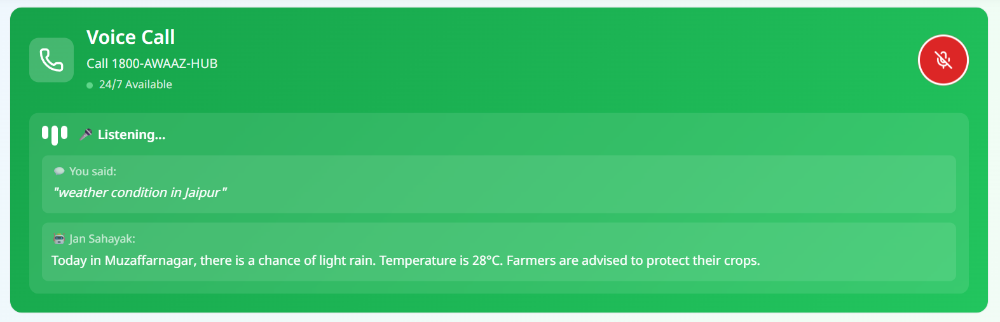
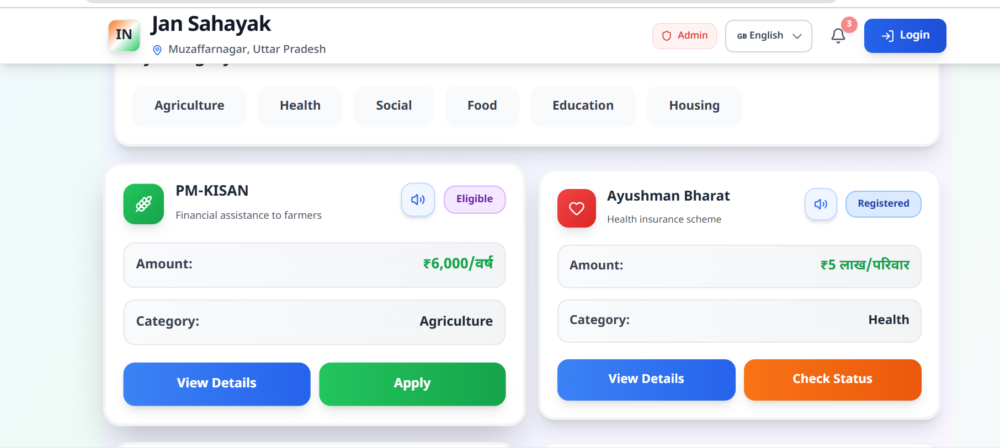
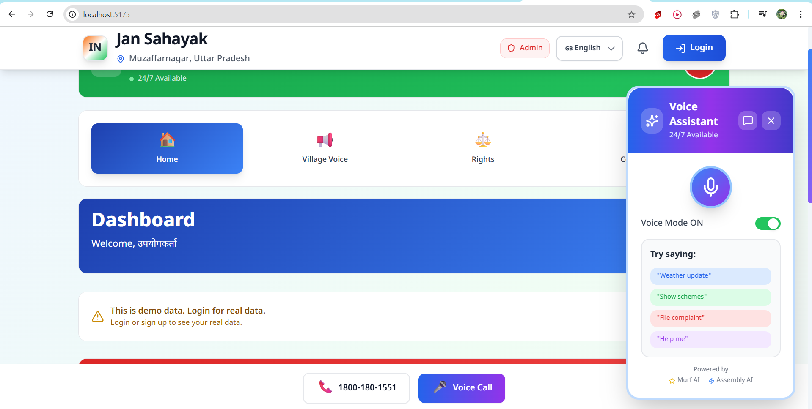
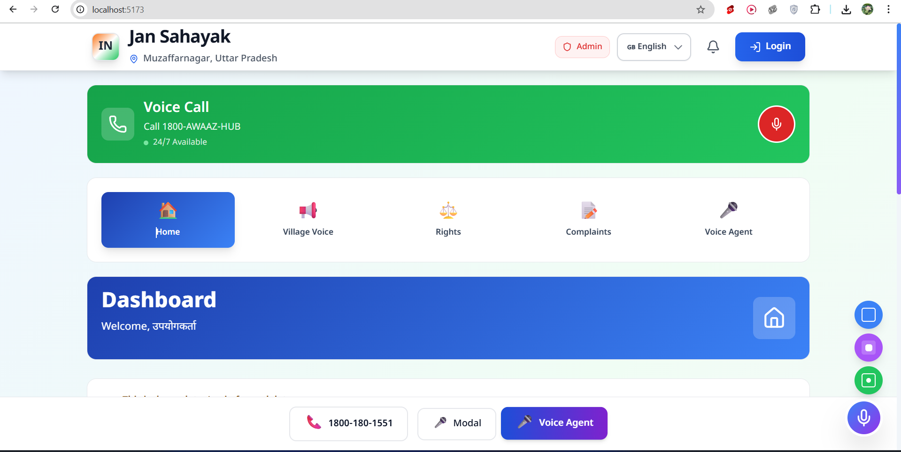

# Implementation Tasks

- [x] 1. I'm getting an error  while completing my profile :- setUserInfo is not defined , if it is not resolved i can't see the government schemes eligiblity ... Also since its a project challenge for MUrf AI which is basically for making voice agents so can this project be more modified to voice sort of thing so that winning chances may increase 

-

- [ ] 2. see still getting setUserInfo error ....How can i make it more voice agent sort of thing just give me idea 

- [ ] 3. Still getting the error 10:42:11 pm [vite] (client) Pre-transform error: C:\Users\ravin\Downloads\Murf-CC4\src\components\SamudayikAwaaz.jsx: Unexpected token (683:44)

  681 |                             -2 mb-2">
  682 |                                             <User clas
> 683 |                                             <span className
      |                                             ^
  684 |                                                 {selectedLanguage === 'hi' && 'आपने कहा'}
  685 |                                                '}
  686 |                                      '}
  Plugin: vite:react-babel
  File: C:/Users/ravin/Downloads/Murf-CC4/src/components/SamudayikAwaaz.jsx:683:44
  695 |
  696 |
  697 |                                 सहायक'}
      |          ^
  698 |  k'}
  699 |                                                      {selectedLanguag

- [x] 4. Can i have a voice agent to help rural people in performing tasks so that i can use Murf Ai with the best possible , we can have websockets for real time data and assembly ai too... tell me ideas what i can have 

- [x] 5. This voice agent can be implemented alag se , on the Ui so it can be the main part of the project . also im getting same response for weather related question for all the places ... i want the original data  , if im logged out then only I'm able to see schemes else after login I'm not able to see also  in this image view status is working else check status and apply is not working i want the real schemes and if a person tries to apply he can redirect to the original schemes page 

- [x] 6.  this voice agent is disturbing the complete Ui so either we can have a different route for this or we can blur other things if we are opening this voice agent 

- [ ] 7. we have so man mics thing  i think we should remove duplicates like we should have one at the footer and three modals are on right side , basically remove the bottom most right most mic icon and remove model from footer , 2 things to remove

